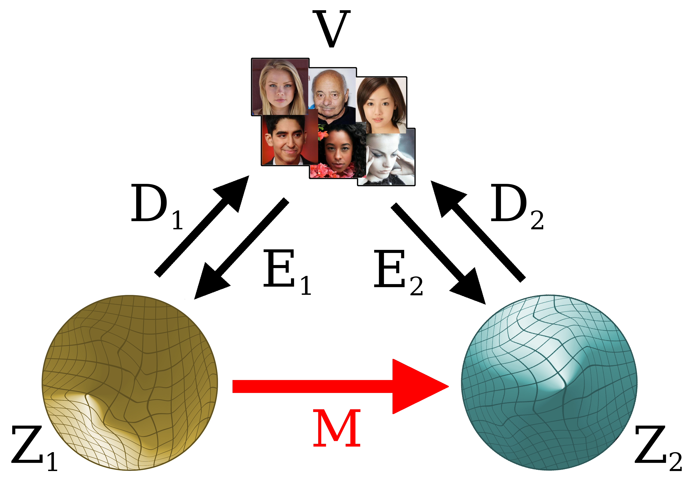
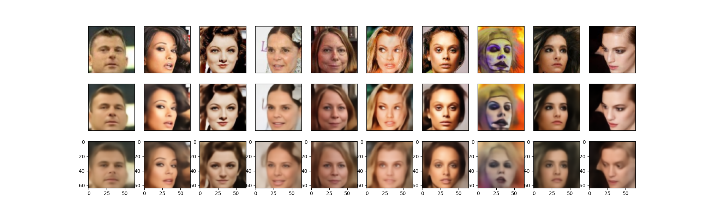
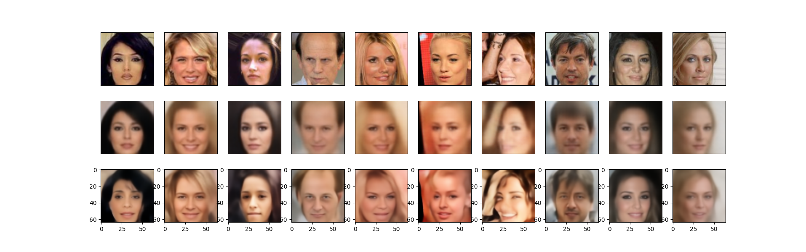
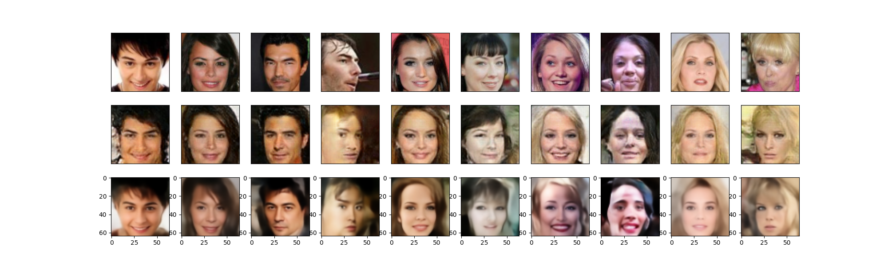

# We love latent space
Repository relative to the article <a href="https://arxiv.org/abs/2207.06812">Comparing the latent space of generative models</a>, joint work with Valerio Tonelli

In this work we
address the problem of comparing the latent spaces of different models,
looking for transformations between them. 

Given a generative model, it is usually possible to have an encoder-decoder pair mapping
the visible space to the latent one (even GANs can be inverted, see Section 2.2.1). From this assumption, it is always possible to map an internal
representation in a space Z1 to the corresponding internal representation in a different space Z2 by
passing through the visible domain. This provides a supervised set of input/output pairs: we can try
to learn a direct map, as simple as possible. 

The astonishing fact is that a simple linear map gives
excellent results, in many situations. This is quite surprising, given that both encoder and decoder
functions are modeled by deep, non-linear transformations.

We tested mapping between latent spaces of:
- different trainings of a same model (Type 1)
- different generative models in a same class, e.g different VAEs (Type2)
- generative models with different learning objectives, e.g. GAN vs. VAE (Type3)

In all cases, a linear map is enough to pass from a space to another preserving most of the information.

Some examples are provided below. In the first row we have the original, in the second row the image reconstructed by the first generative model, and in the third row the image obtained by the second model after linear relocation in its space.

Relocation of Type 1, between latent spaces relative to different training instances of the same generative model, in this case a 
<a href="https://ieeexplore.ieee.org/document/9804716">Split Variational Autoencoder</a>. The two reconstructions are almost identical.}

Relocation of Type 2, between a Vanilla VAE and a state-of-the-art Split-VAE. The SVAE produces better quality images, even if not necessarily in the direction of the original: the information lost by the VAE during encoding cannot be recovered by the SVAE, which instead makes a reasonable guess.

Relocation of Type 3, between a vanilla GAN and a SVAE. Additional examples involving StyleGAN are given in the article. To map the original image 
(first row) into the latent space of the GAN we use an inversion network.  
Details of reconstructions may slightly differ, but colors pose and the overall  appearance is surprisingly similar. In
some cases (e.g. the first picture) the reconstruction 
re-generated by the VAE (from the GAN encoding!) is closer to
the original than that of the GAN itself.

